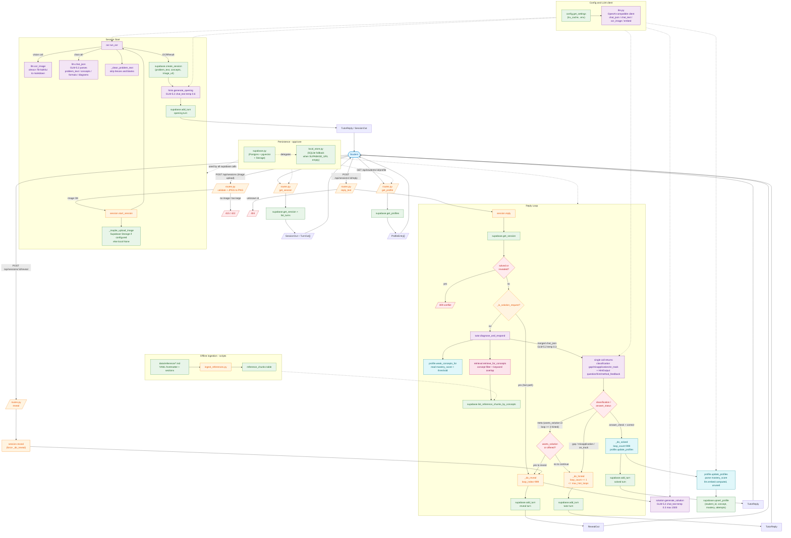

# AI Tutor — Workflow

## Key design components

| Layer | Component | Role |
|---|---|---|
| API | `app/api/routes.py` | FastAPI router: image upload, reply, reveal, get-session, get-profile |
| Services | `session.py` | Orchestration state machine: start → reply → reveal/solved |
| Services | `ocr.py` | Two-step OCR (olmocr markdown → GLM-5.2 parse) |
| Services | `tutor.py` | Single merged LLM call: diagnose classification + produce `HintOutput` |
| Services | `hints.py` | Opening message + human-readable hint summarization |
| Services | `solution.py` | Full-solution generation (post-loop or explicit request) |
| Services | `retrieval.py` | Concept-filter + keyword-overlap retrieval over reference chunks |
| Services | `profile.py` | Weak-concept detection + post-resolution mastery upsert |
| LLM | `app/core/llm.py` | Async OpenAI-compatible client; CoT stripping + JSON extraction |
| Prompts | `app/prompts/guided_discovery.py` | All prompt templates (OCR, opening, tutor, solution, profile) |
| Config | `app/core/config.py` | pydantic-settings `Settings` (cached) |
| Persistence | `app/core/supabase.py` | Postgres + pgvector + Storage helpers |
| Persistence | `app/core/local_store.py` | SQLite fallback when `SUPABASE_URL` is empty |
| Offline | `scripts/ingest_references.py` | Parse `data/reference/*.md` into `reference_chunks` |
| Frontend | `app/static/index.html` + `app.js` | Minimal SPA; KaTeX rendering |

## Loop / resolution semantics

- **Normal flow:** up to `max_hint_loops` (default 3) progressive hints, each via `tutor.diagnose_and_respond`.
- **Fast paths:**
  - Student types a solution-request phrase → `_do_reveal` immediately (skips LLM diagnose).
  - `classification == answer_check` + student's answer is correct → `_do_solved` (records mastery).
  - LLM returns `wants_solution=True` or loop ≥ 3 hinted → offer reveal.
- **Terminal markers:** `loop_count = 999` and `loop_index = 999` on the reveal/solved turn (sentinel, not a real count).
